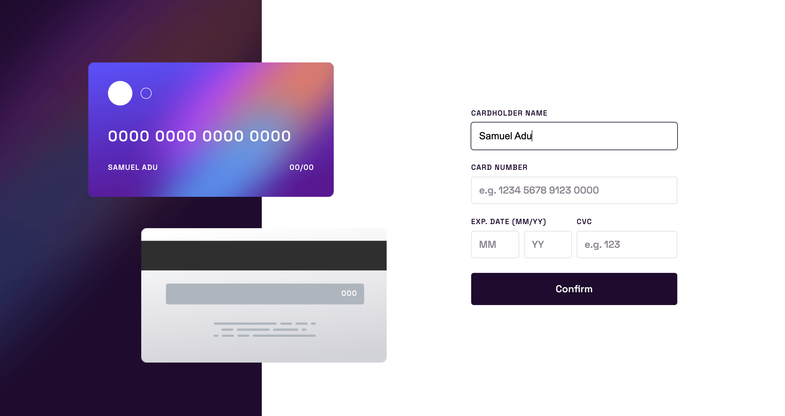

# Frontend Mentor - Interactive card details form solution

This is a solution to the [Interactive card details form challenge on Frontend Mentor](https://www.frontendmentor.io/challenges/interactive-card-details-form-XpS8cKZDWw). Frontend Mentor challenges help you improve your coding skills by building realistic projects.

## Table of contents

- [Overview](#overview)
  - [The challenge](#the-challenge)
  - [Screenshot](#screenshot)
  - [Links](#links)
- [My process](#my-process)
  - [Built with](#built-with)
  - [What I learned](#what-i-learned)
  - [Useful resources](#useful-resources)
- [Author](#author)

## Overview

### The challenge

Users should be able to:

- Fill in the form and see the card details update in real-time
- Receive error messages when the form is submitted if:
  - Any input field is empty
  - The card number, expiry date, or CVC fields are in the wrong format
- View the optimal layout depending on their device's screen size
- See hover, active, and focus states for interactive elements on the page

### Screenshot

### Links

- Solution URL: [https://www.frontendmentor.io/solutions/interactive-card-details-form-using-react-hook-form-dzXi9o61IL](https://www.frontendmentor.io/solutions/interactive-card-details-form-using-react-hook-form-dzXi9o61IL)
- Live Site URL: [https://interactive-card-details-form-silk.vercel.app](https://interactive-card-details-form-silk.vercel.app)

## My process

### Built with

- Semantic HTML5 markup
- CSS custom properties
- Flexbox
- Mobile-first workflow
- [React](https://reactjs.org/) - JS library
- [React Hook Form](https://react-hook-form.com/api/) - For form design and validation

### What I learned

I learned how to use the react-hook-form library in this project. Before now i usually have to write a lot of JavaScript for form validataion and I was good with React Controlled Forms but the react-hook-form library is a game changer and it makes my work faster.

### Useful resources

- [React Hook Form](https://react-hook-form.com/) - The react hook form official documentation is what i first read to understand the library, although the examples provided in the doc are not very explanatory, however if you go through it properly you will be able to use the library with ease.

- [How to Create Forms in React using react-hook-form by Yogesh Chavan](https://www.freecodecamp.org/news/how-to-create-forms-in-react-using-react-hook-form/) - This is an amazing article which helped me finally understand react-hook-form an the implementation. I'd recommend it to anyone still learning this concept.

## Author

- Website - [Samuel Adu](https://samueladu.com)
- Frontend Mentor - [@theadusamuel](https://www.frontendmentor.io/profile/theadusamuel)
